# kottans-frontend
Привіт, котани! Моє ім'я Олег, мені 30 і я вирішив відкрити для себе ІТ. 

За освітою я історики, але професійну кар'єру з історією не пов'язав. Натомість майже 10 років працював у сфері комунікацій, інформації та контент мейкінгу. IТ було для мене завжди цікавим, але здавалось чимось абсолютно протележним до уявлень та світосприйняття типового гуманітарія) Кожного чергового разу, коли мені закрадалась думка "а чи не кинути все і спробувати себе в ІТ?", я відкладав цей крок десь на післязавтра... і ось це "післязавтра" наступило, чому я безмежно радий! Для мене це виклик самому собі, але разом з тим цікавий тріп, який вже розпочався. 

Погнали! 

# General

- [x] Git Basics
- [x] Linux CLI and Networking
- [x] VCS (hello gitty), GitHub and Collaboration

## Git Basics
Все було абсолютно новим для мене і достатньо заплутаним спочатку. Зізнаюсь, лекції на Coursera довелось передивлятись по 2-3 рази, щоб хоч трішки розібратись з теорією "на пальцях", але без цього нікуди. Зроблено!

Week 1

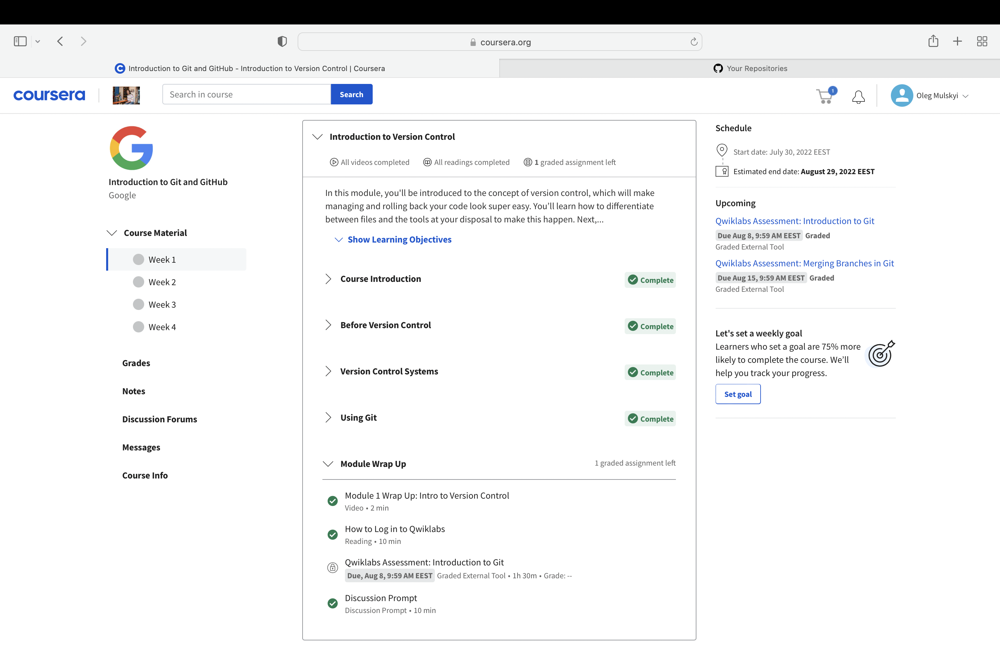

Week 2

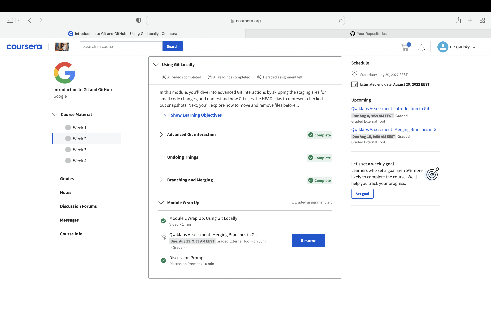

А от виконання практичних вправ на learngitbranching - це вже інша справа) Окрім того, що все стало зрозумілішим, та ще й з'явився азарт, коли після вдалого проходження завдання вводив reset і починав заново, щоб добитись бажаного результату у визначену кількість кроків. Фуууух)

Foundations

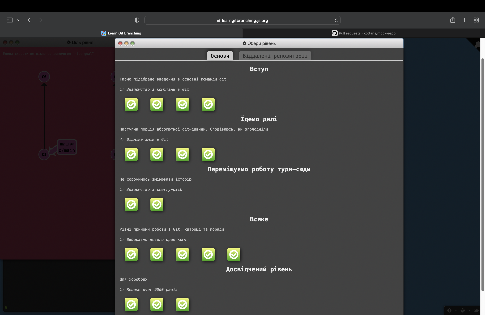

Remote repositories

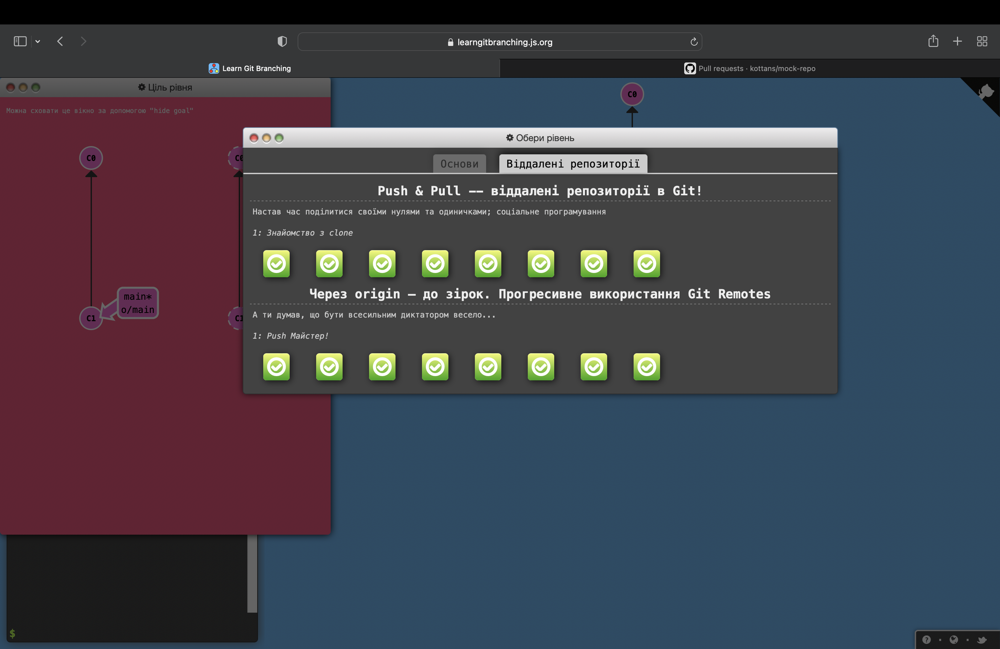

## Linux CLI and HTTP

Поки що Linux виявився для мене найзрозумілішою темою. Цьому дуже посприяло те, що команди мають логічний синтаксис, а також практика після кожного блоку - це прямо гуд! Зрозумів для себе, що найкраще сприймаю і засвоюю інформацію саме в такій комбінації "теорія+практика".

Quiz 1

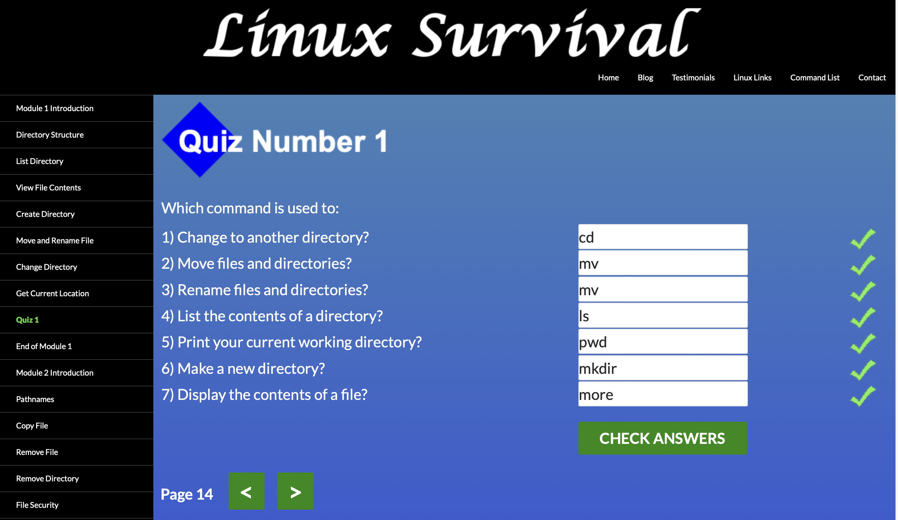

Quiz 2

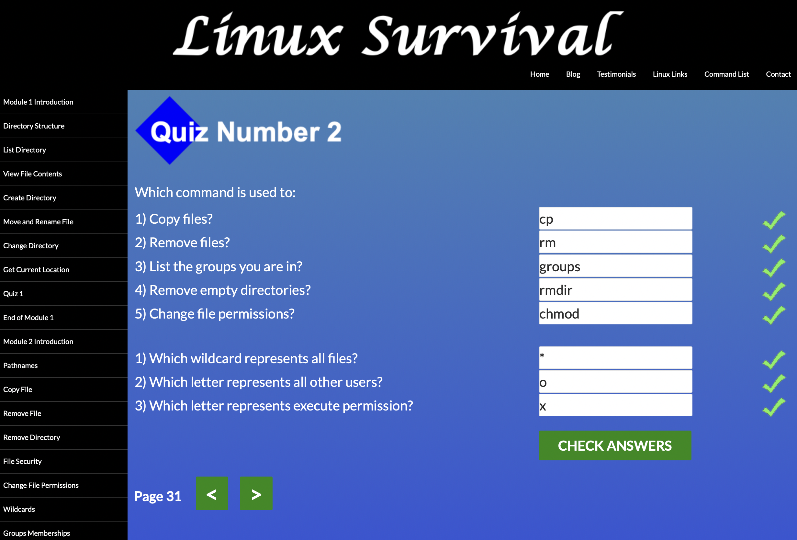

Quiz 3

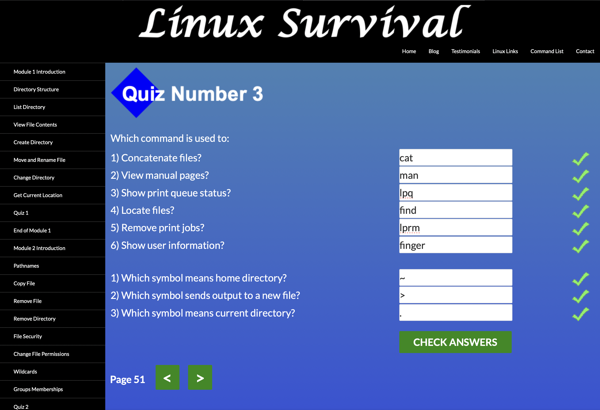

Quiz 4

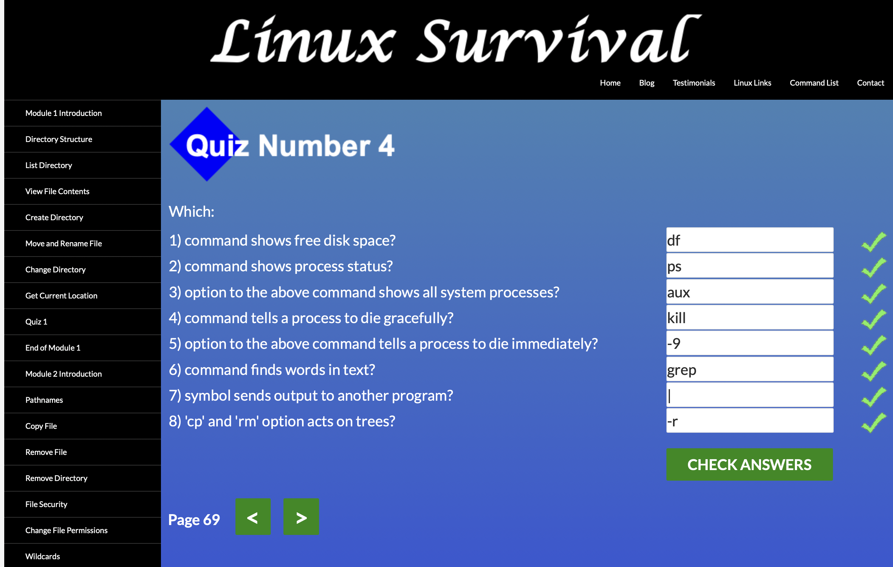

А от HTTP дався достатньо важко (та й чи дався - це питання). Багато інформації, термінів. Розумію, що потрібно це переварити і десь почати розглядати вже в практичному ключі, щоб потім повернутись до теорії ще раз. Почитав також додаткові матеріали, які рекомендувались в статті - стало ще гірше)) Але хто казав що буде легко?) Працюємо!

## Git Collaboration

На цей раз матеріал дався достатньо легко. Багато з цього вдалось спробувати при створенні форку навчального репозиторію з подальшим pull request (+ довелось самостійно розбиратись із коментарем одного з менторів та тим, як на нього відповісти і внести коректні зміни) - тому ці два навчальні тижні пройшли на одному диханні. Побачив класний спосіб працювати з коментарем даючи одразу інформацію по ньому у відповідь (маю на увазі # і номер коментаря). Якби знав раніше - відповів би ментору саме в такий спосіб)

Week 3

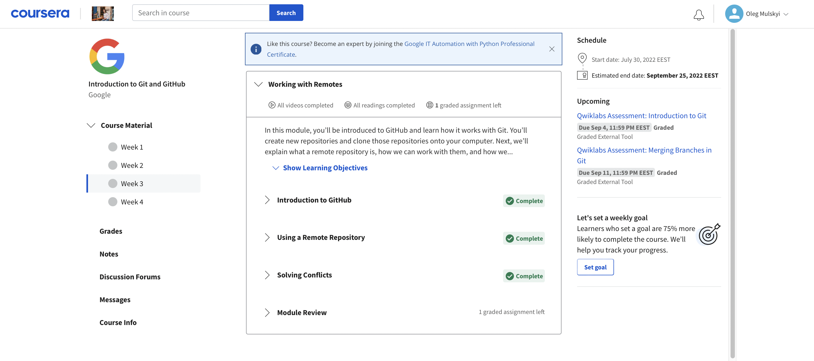

Week 4

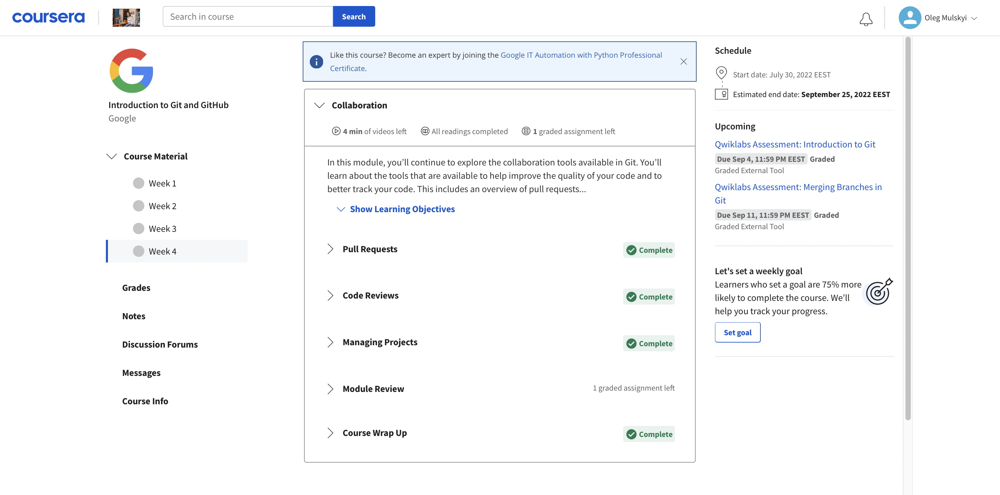

А ось тут взагалі вийшло кумедно) Я з гарячу пройшов всі рівні ще виконуючи завдання learngitbranching. Ніяк не міг зрозуміти, чому мені так важко даються останні рівні і як ви пигите, що це можливо зробити за два кроки, а я ледве в 5 входжу) Довелось гуглити, шукати команди і їхні варіації, щоб пройти все. Зате в задоволення було слухати лекції 3 і 4 тижня - це систематизувало те що спробував на практиці сам + дало уявлення про те, в чому відмінності між командами, які стосуються взаємодії локального та віддаленого репозиторіїв. Скріншоти продублюю ті, які були вище)

Foundations

Remote repositories

# Front-End Basics

- [x] Intro to HTML & CSS
- [ ] Responsive Web Design
- [ ] HTML & CSS Practice
- [ ] JavaScript Basics
- [ ] Document Object Model - practice

## Intro to HTML and CSS

Обидві теми виявились достаньо зрозумілими та доступними в матеріалах. Дуже сподобалось, що буквально кожний аспект пояснювався окремо і одразу з прикладами. Неймовірно захопив CSS. Я й гадки не мав, що всю візуальну магію робить саме цей "негідник") P.S. Боюсь уявити, що ж там буде із JS.

Week 1

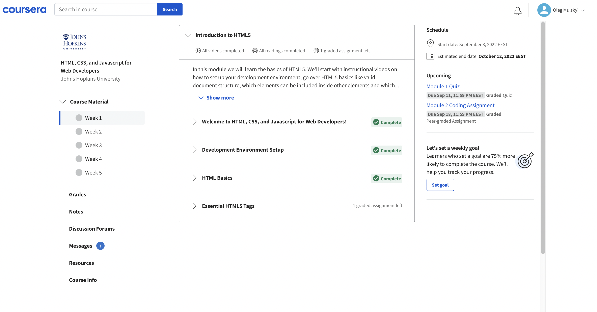

Week 2

# Advanced Topics

- [ ] Building a Tiny JS World (pre-OOP) - practice
- [ ] Object oriented JS - practice
- [ ] OOP exercise - practice
- [ ] Offline Web Applications - optional
- [ ] Memory pair game — real project!
- [ ] Website Performance Optimization - optional
- [ ] Friends App - real project!

